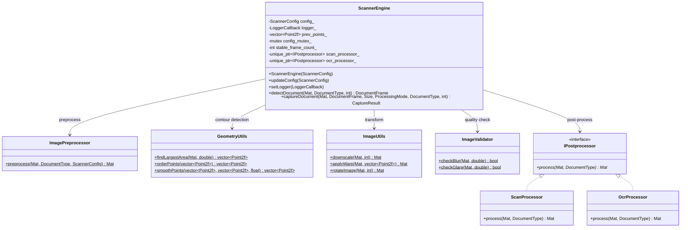
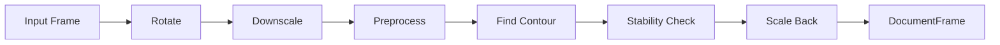
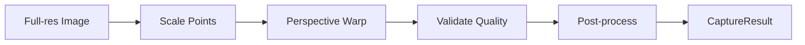
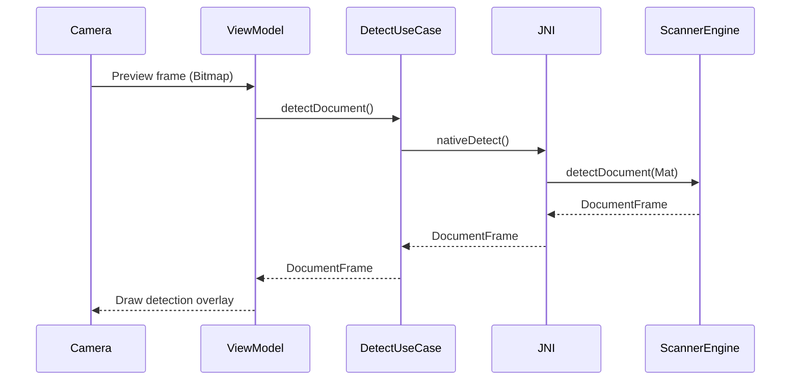
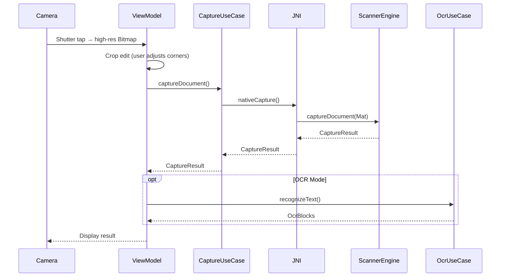
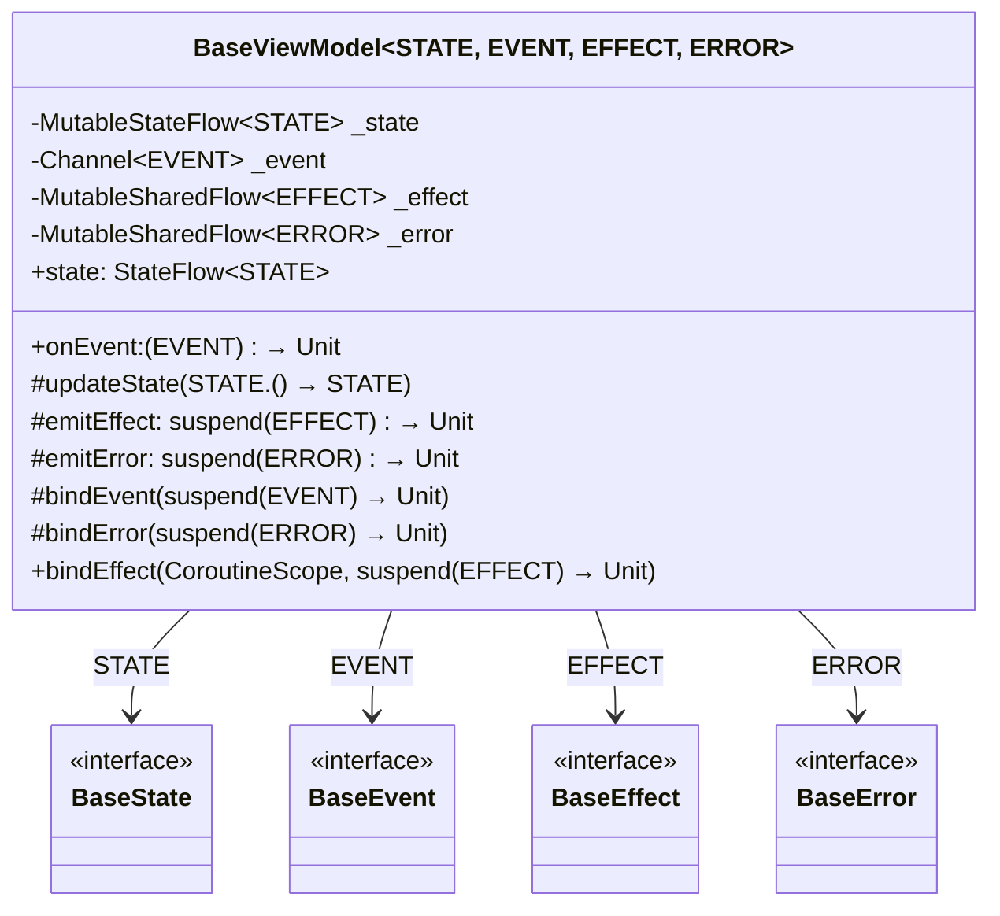
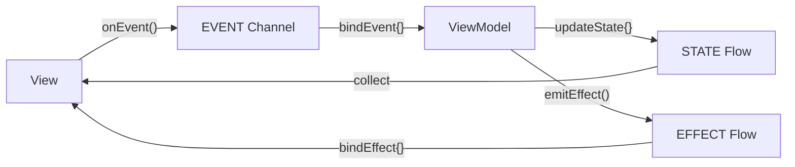
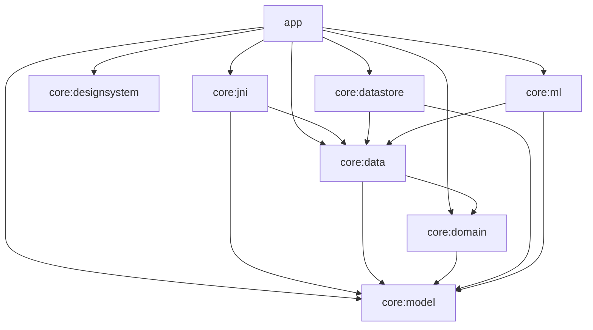
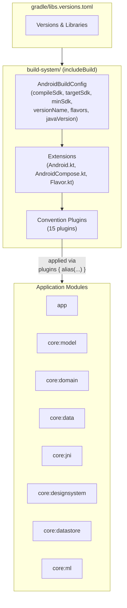

# Native Scanner

A cross-platform document scanner powered by a shared C++ core engine (OpenCV) with an Android application built on Jetpack Compose and MVI architecture.

## Key Features

- **Real-time Document Detection** — Multi-criteria contour scoring with EMA smoothing for stable detection
- **Auto-stability Detection** — Hands-free capture trigger when document corners stabilize
- **Perspective Correction** — Four-point warp transform for distortion-free output
- **Dual Processing Modes** — Scan mode (clean whitening) and OCR mode (sharp binarization) via Strategy pattern
- **Image Quality Validation** — Laplacian-based blur detection and overexposed pixel ratio glare check
- **ML Kit OCR** — Korean text recognition on captured documents
- **Custom Design System** — "Soft Monotone" theme built with Jetpack Compose

## Architecture Overview

The project is organized into three layers designed for cross-platform reuse:

- **C++ Core** — Platform-agnostic scanning engine built on OpenCV. Handles all image processing, contour detection, perspective correction, and post-processing.
- **Platform Bindings** — JNI bridge for Android. iOS (Objective-C++) and desktop bindings are scaffolded.
- **Android App** — Jetpack Compose UI with custom MVI architecture, Clean Architecture domain layer, and Hilt dependency injection.

## Project Structure

```
native-scanner/
├── cpp/                        # C++ core engine & platform bindings
│   ├── core/                   # Scanning engine (OpenCV)
│   ├── android/                # JNI bridge (ScannerWrapperJni.cpp)
│   ├── ios/                    # iOS bindings (planned)
│   └── desktop/                # Desktop parameter tuning GUI
├── android/                    # Android application
│   ├── app/                    # Main app module
│   ├── core/                   # Core library modules
│   └── build-system/           # Convention plugins (includeBuild)
├── ios/                        # iOS application (planned)
├── libs/                       # OpenCV prebuilt libraries
└── docs/                       # Specifications & documentation
```

---

## C++ Core

### Class Diagram



### Document Detection Flow

Real-time processing pipeline for each camera preview frame:



### Document Capture Flow

High-resolution processing pipeline triggered on shutter:



### Desktop Tuning Tool

The `cpp/desktop/` module provides an OpenCV GUI application for real-time parameter tuning. It opens a webcam feed with trackbar sliders for blur, glare, canny, and target width parameters, enabling rapid iteration on detection thresholds without deploying to a mobile device.

---

## Android

### Project Structure

```
android/
├── app/                            # Main app module (UI, navigation, ViewModels)
├── core/
│   ├── model/                      # Data classes (DocumentFrame, CaptureResult, ScannerConfig, ...)
│   ├── domain/                     # Use cases & repository interfaces
│   ├── data/                       # Repository implementations & data source abstractions
│   ├── jni/                        # JNI bridge wrapper (NativeScanner.kt → libnative-scanner.so)
│   ├── designsystem/               # Custom Compose design system ("Soft Monotone" theme)
│   ├── datastore/                  # Preferences persistence (AndroidX DataStore)
│   └── ml/                         # ML Kit OCR integration (Korean text recognizer)
└── build-system/                   # Convention plugins (standalone includeBuild)
```

### Document Detection Sequence



### Document Capture Sequence



### MVI Architecture

The app uses a custom MVI (Model-View-Intent) framework built on a generic `BaseViewModel`:



**MVI Cycle:**



| Channel | Type | Behavior |
|---|---|---|
| `STATE` | `MutableStateFlow` | Always holds current value, observers receive latest state on subscription |
| `EVENT` | `Channel` | Buffered, `DROP_OLDEST` backpressure — user intents never block the UI |
| `EFFECT` | `MutableSharedFlow` | 64-capacity buffer — one-shot side effects (navigation, toast) survive config changes |
| `ERROR` | `MutableSharedFlow` | 1-capacity buffer, `DROP_OLDEST` — dedicated error propagation stream |

### Multi-Module & Build System

#### Module Dependency Graph



#### Build System Architecture

The project uses a **convention plugin** architecture via Gradle's `includeBuild` mechanism. The `build-system/` directory is a standalone Gradle project that compiles independently and provides 15 custom plugins to the main build.



Each module applies plugins declaratively — a single `alias(libs.plugins.scanner.android.library.compose)` replaces hundreds of lines of boilerplate configuration. Plugins compose on top of each other: for example, `scanner.android.library.compose` builds upon `scanner.android.library` by adding Compose compiler configuration.


## Screenshots

<!-- Add your screenshot images here -->
<!-- Example:  -->

| Camera Preview |
|:-:|
| *Add screenshot here* |

---

## License

This project is licensed under the MIT License — see the [LICENSE](LICENSE) file for details.